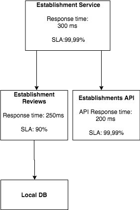
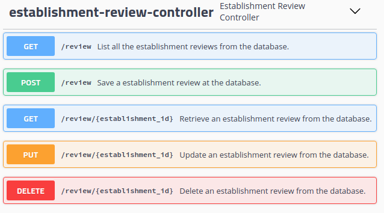
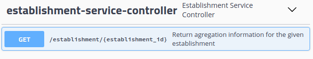

# EstablishmentService
This project has the goal to register establishment reviews for  establishments at the [Food Hygiene Rating Scheme API](http://api.ratings.food.gov.uk/help), and give the aggregation information from both reviews and API in one single endpoint.

## 1. Microservices Overview
To solve this challenge a microservice approach was used, generating two microservices: Establishment Reviews and Establishment Service. In addition to an Eureka Server to manage those two microservices.
The following high level diagram gives more details about this solution.



### 1.1 Eureka Server
Is an application that holds the information about all client-service applications. Every micro service will register into the eureka server.

### 1.2 Establishment Reviews
Is a microservice that will perform CRUD operations on Establishment Reviews.
It has the falowing endpoints:

 

### 1.3 Establishment Service
Is a microservice that will call the Food Hygiene Rating Scheme API and Establishment Reviews microservice for the given establishment id, then will return the aggregation information from both.
Has the following enpoints:

 

## 2. How to run
To run the microservices is nescessery to start the eureka server and both microservices.
In order to do this is necessary to run the comands bellow at the cloned folder.
To run the Eureka Server
```
cd EurekaServer/
mvn install spring-boot:run
```
To run the Establishment Review Microservice
```
cd EstablishmentReviewsService/
mvn install spring-boot:run
```
To run the Establishment Service Microservice
```
cd EstablishmentService/
mvn install spring-boot:run
```
For each one of those applications the maven will run unit tests and will the start the servers.
## 3. How to use
The servers will start at the following urls:

Eureka server - [http://localhost:8761](http://localhost:8761)

Establishment Reviews - [http://localhost:8200](http://localhost:8200)

Establishment Service - [http://localhost:8100](http://localhost:8100)

Establishment Reviws and Establishment Service are using Swagger for the API documentation and to test calls. Please refer the links bellow to access the Swager interface and obtain more information about the endpoints for each Microservice

Establishment Reviews - [http://localhost:8200/swagger-ui.html](http://localhost:8200/swagger-ui.html)

Establishment Service - [http://localhost:8100/swagger-ui.html](http://localhost:8100/swagger-ui.html)

